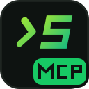

<p></p>

# NeuroSquad Browser MCP

[](https://github.com/glmn-ai/neurosquad-browser-mcp/actions/workflows/ci.yml)
[](LICENSE)

**Let your local AI agents read and drive the Chrome tabs you already have open — over MCP.**

NeuroSquad Browser MCP is a Chrome extension plus a small local [Model Context Protocol](https://modelcontextprotocol.io)
server. Coding agents — Claude Code, Codex CLI, OpenCode, Cursor, or the agent cards in
[NeuroSquad](https://neurosquad.ai) — get `browser_*` tools to list tabs, read a page, click, fill
forms, run JavaScript, take screenshots, read console logs and attach files. They work in **your**
browser, with your sessions, instead of a separate headless one.

Everything runs on your machine: the extension talks only to the server on `127.0.0.1`, and the
server talks only to the agent that started it.

*Formerly **WebMCP** (renamed in 1.4.0; see [Compatibility](#compatibility)).*

```
AI agent  <-- stdio (MCP) -->  server/  <-- ws://127.0.0.1:47615 -->  extension/  <-->  your tabs
```

## You always see when it's working

While an agent is acting in a tab, the page gets a soft, breathing **green glow** around its edges
and a small **"NeuroSquad MCP is working"** island at the bottom centre that says what is happening
right now — *Opening a page*, *Clicking*, *Typing*, *Reading the page*, *Running a script*,
*Attaching files* (in Russian if your browser is set to Russian). It fades out a moment after the
last call. The overlay never takes clicks (`pointer-events: none`), lives in a closed shadow root so
it can't disturb the page, and is hidden while a screenshot is taken.

The toolbar popup shows whether the extension is connected, the hub's process id, how many MCP
sessions are attached, and the server and extension versions.

## Tools

| Tool | What it does |
| --- | --- |
| `browser_list_tabs` | List all open tabs (id, title, url, active). |
| `browser_get_page_info` | Id, title and url of a tab. |
| `browser_get_page_content` | Visible text or full HTML of a page. |
| `browser_query_selector` | Run `querySelectorAll` and return the matched elements' tag, text and attributes. |
| `browser_click` | Click the first element matching a CSS selector. |
| `browser_fill` | Set the value of an input, textarea or contenteditable and fire `input`/`change`. |
| `browser_navigate` | Navigate a tab to a URL. |
| `browser_execute_script` | Run JavaScript in the page's own context and return the result. |
| `browser_upload_files` | Put local files into an `<input type=file>` (attachments, uploads). |
| `browser_screenshot` | PNG screenshot of the visible area of a tab. |
| `browser_get_console_logs` | Buffered `console.*` output and uncaught errors of a tab. |
| `browser_connection_status` | Whether the extension is connected, plus this server's role (`hub`/`peer`), the hub pid and the number of peers. |

Every tool takes an optional `tabId`; without it, the active tab of the last focused window is used.

## Install

You need Node.js 22 or newer and Chrome (other Chromium browsers with extension support should
work too).

### 1. Get the code and install the server

```sh
git clone https://github.com/glmn-ai/neurosquad-browser-mcp.git
cd neurosquad-browser-mcp/server
npm install
```

`npm install` also runs `setup.js` (a `postinstall` script). It looks for the MCP clients installed
on your machine — OpenCode, Claude Code, Cursor, Codex CLI — and adds a `webmcp` server entry to
each of their configs (details in [MCP client setup](#mcp-client-setup)). It never overwrites an
existing entry and writes a `.bak` copy before changing a file. Don't want that? Use
`npm install --ignore-scripts` and configure your client by hand. Re-run it any time with
`npm run setup`.

**Restart the client(s) it updated** (or start a new session) so they start the server.

### 2. Load the extension

*Chrome Web Store: coming later.* Until then, load it unpacked:

1. Open `chrome://extensions`.
2. Turn on **Developer mode** (top right).
3. Click **Load unpacked** and select the `extension/` folder of this repository.
4. Pin **NeuroSquad Browser MCP** to the toolbar to see its status.

The popup also opens as a tab right after installing. Its dot turns green once an MCP session has
started the server and the extension has connected — until then it stays red, which is normal.

After pulling a new version, press the reload button on the extension's card in
`chrome://extensions` and restart your MCP sessions.

### 3. Try it

With a page open in Chrome, ask your agent:

```
use the browser tools to tell me what's on the current page
click the "Submit" button
fill the search box with "hello" and show me the console errors
```

## MCP client setup

`setup.js` (and the popup's **Install into MCP clients** button, which asks the running server to
do the same thing) edits these files:

| Client | Config file | Entry |
| --- | --- | --- |
| OpenCode | `~/.config/opencode/opencode.json` | `mcp.webmcp` (JSONC) |
| Claude Code | `~/.claude.json` | `mcpServers.webmcp` (user scope) |
| Cursor | `~/.cursor/mcp.json` | `mcpServers.webmcp` |
| Codex CLI | `~/.codex/config.toml` | `[mcp_servers.webmcp]` |

A client counts as installed when its config directory exists. The entry runs `server/src/index.js`
with the exact Node binary that ran the installer (so GUI apps without Node in `PATH` work too).
JSON/JSONC files are edited surgically with `jsonc-parser`, keeping your comments and other servers.

To configure a client by hand, add a stdio MCP server named `webmcp` that runs
`node /path/to/neurosquad-browser-mcp/server/src/index.js`. For OpenCode, for example:

```jsonc
{
  "$schema": "https://opencode.ai/config.json",
  "mcp": {
    "webmcp": {
      "type": "local",
      "command": ["node", "/path/to/neurosquad-browser-mcp/server/src/index.js"],
      "enabled": true
    }
  }
}
```

For Claude Code: `claude mcp add --scope user webmcp -- node /path/to/neurosquad-browser-mcp/server/src/index.js`.

### Environment variables

| Variable | Default | Meaning |
| --- | --- | --- |
| `WEBMCP_PORT` | `47615` | Port of the local hub. If you change it, set the same port in the extension popup. |
| `WEBMCP_EXTENSION_IDS` | *(any)* | Comma-separated extension ids allowed to connect (see `chrome://extensions`). Recommended. |
| `WEBMCP_TOKEN_FILE` | `~/.webmcp/peer-token` | Where the shared peer token lives. |

## Security and permissions

This extension gives software on your computer control over your browser — that is the point of it,
and it is also why you should understand exactly what it can do. In short: **an agent connected
through it can do anything you can do in your logged-in tabs.** Only connect agents you trust, and
watch for the green glow.

### Why the extension needs each permission

| Permission | Why |
| --- | --- |
| `<all_urls>` (host permission) | Agents work on whatever page you have open, so the extension must be able to read and script any site. Without it, every tool would need a per-site grant. |
| `scripting` | Reading the page, querying elements, clicking, filling, running `browser_execute_script`, showing the glow and island. |
| `debugger` | Only for two things the normal APIs can't do: running a script on pages whose Content-Security-Policy forbids `eval` (x.com, github.com, …) and setting files on `<input type=file>` (`browser_upload_files`). It attaches to one tab for the duration of that call and detaches right after; Chrome shows its "started debugging this browser" bar meanwhile. |
| `tabs` | Listing tabs and their titles/urls, navigating, switching to a tab for a screenshot (Chrome can capture only the visible tab). |
| `activeTab` | Capturing the visible tab for screenshots. |
| `storage` | Remembering the port you set in the popup. |
| `alarms` | Waking the MV3 service worker every 30 s to reconnect to the server when it starts. |

Two content scripts run on every page at `document_start`: one wraps `console.*` and listens for
uncaught errors so `browser_get_console_logs` can return them; the other relays those lines to the
extension. They do nothing else.

### What leaves the browser, and where it goes

- The extension connects to **one** place: `ws://127.0.0.1:<port>/` on your own machine. It makes no
  other network requests — no analytics, no telemetry, no remote code; fonts and icons are bundled.
- What it sends there: the results of tool calls (page text/HTML, element info, script results,
  screenshots, tab titles and urls) and the console output of your tabs, while a server is
  connected. The server keeps console lines in memory (per tab, bounded) and passes everything to
  the agent that asked. **What the agent then does with it — including sending it to its model
  provider — is up to that agent.**
- `browser_upload_files` reads files from disk by path and attaches them to a page; the agent
  chooses the paths.

### How the local server is protected

- The hub listens on `127.0.0.1` only, never on other interfaces.
- The extension endpoint accepts only WebSocket handshakes whose `Origin` is a
  `chrome-extension://` id; web pages (`https://…` origins) and clients without an origin get 403.
  Set `WEBMCP_EXTENSION_IDS` to accept only your copy of the extension.
- Other server processes (one per MCP session) join the hub on `/peer`, which requires a random
  256-bit token from `~/.webmcp/peer-token` (created with mode 600, compared in constant time) and
  rejects any `Origin`. Web pages can't set that header or read that file.
- Limits of this model: the extension does not authenticate the server. **Any program running as
  your user** can start a server on that port (or read the token) and drive the browser, just like
  your MCP clients do. Treat it like any other local developer tool with that power.

Found a problem? Please report it privately — see [SECURITY.md](SECURITY.md).

## Many sessions at once: hub and peers

Every MCP session (each Claude Code / OpenCode / Cursor window, each agent) starts its own server
process, but there is one extension and one port. The processes organise themselves:

```
Chrome extension ──ws://127.0.0.1:47615/──▶ HUB (whichever process bound the port first)
                                            ▲   ▲
             PEER (session 2) ──/peer──────┘   └──────/peer── PEER (session 3)
```

- **Hub** — the process that bound `127.0.0.1:47615`. The extension connects to it. It forwards
  requests from all sessions over one socket (request ids are UUIDs), routes each answer back,
  keeps the per-tab console buffers and answers the popup's install actions.
- **Peers** — every other process. On `EADDRINUSE` they check `http://127.0.0.1:47615/webmcp` to make
  sure the port belongs to a hub, then connect to `/peer` and send their calls through it.
- **Failover** — when the hub's session ends, peers race to bind the port (with jitter); the winner
  becomes the hub and the extension's reconnect loop (0.25 s → 5 s backoff) finds it within about a
  second. Calls made during the switch wait for it (up to ~10 s); a call that was in flight on the
  dead hub fails with a "try again" error — clicks and navigation aren't idempotent, so they are not
  retried automatically.
- **No hanging calls** — if Chrome isn't running, calls fail fast with a clear error. Every request
  has a 15 s timeout.
- **Keep-alive** — the extension pings the hub every 20 s, the hub pings every socket every 15 s,
  and a server process exits when its MCP client closes stdin, so finished sessions don't hold the
  port.

## Troubleshooting

- **Red dot in the popup** — no server is running on that port: start (or restart) an MCP session,
  and check the port in the popup matches `WEBMCP_PORT`.
- **"Could not reach the WebMCP hub … port held by another program or an old webmcp version?"** —
  something else owns the port. Restart that session or wait: the server retries and takes over when
  the port frees.
- **`browser_connection_status`** shows `role`, `hubPid`, `peers` and `connected` from any session.
- Server logs go to stderr (stdout carries MCP). Extension logs are in the service worker console
  (`chrome://extensions` → the extension → *service worker*).

## Notes and limitations

- One extension connection at a time; a new one (extension reload, a second profile) replaces the
  old one.
- Console buffers live in the hub; after a failover they start empty. Logs from frames that existed
  before the extension was installed or reloaded appear after the page is reloaded.
- `browser_execute_script` and `browser_query_selector` run in the page's main world. On strict-CSP
  pages scripts go through the DevTools protocol instead (see `debugger` above).
- `browser_screenshot` briefly activates the target tab if it isn't the visible one.

## Compatibility

Only the user-facing name changed in 1.4.0. The MCP config key is still `webmcp` (tools appear as
`mcp__webmcp__browser_*`), and the tool names, port `47615`, the `WEBMCP_*` variables, the token
file `~/.webmcp/peer-token`, the hub protocol and the `extension/` folder are unchanged, so existing
installs keep working after reloading the extension.

## Development

```sh
npm ci                                    # repository tooling (ESLint)
npm ci --prefix server --ignore-scripts   # server dependencies
npm run check                             # node --check on all JS + manifest.json validation
npm run lint
npm test                                  # real server processes, a fake extension, random ports
```

CI runs these on Ubuntu, Windows and macOS and builds the Web Store zip of `extension/` as an
artifact. See [CONTRIBUTING.md](CONTRIBUTING.md) for the workflow.

## Part of NeuroSquad

NeuroSquad Browser MCP is built by the team behind [NeuroSquad](https://neurosquad.ai) — a desktop
app that runs Claude Code, Codex, OpenCode and other coding agents side by side on one canvas and
tells you the moment one needs you. Its browser cards and agents use this extension to work in your
real browser. Prefer the terminal? See [nsq](https://github.com/glmn-ai/neurosquad-cli), our
open-source CLI for running several coding agents at once.

## License

[MIT](LICENSE) © 2026 Stanislav Gelman and NeuroSquad contributors.

Bundled fonts — [Inter](https://github.com/rsms/inter), [Manrope](https://github.com/googlefonts/manrope)
and [JetBrains Mono](https://github.com/JetBrains/JetBrainsMono) — are licensed under the SIL Open
Font License 1.1; their license texts are in [`extension/fonts/licenses/`](extension/fonts/licenses/).
The NeuroSquad name and logo identify the NeuroSquad project; please don't use them in a way that
suggests your fork or product is ours.
